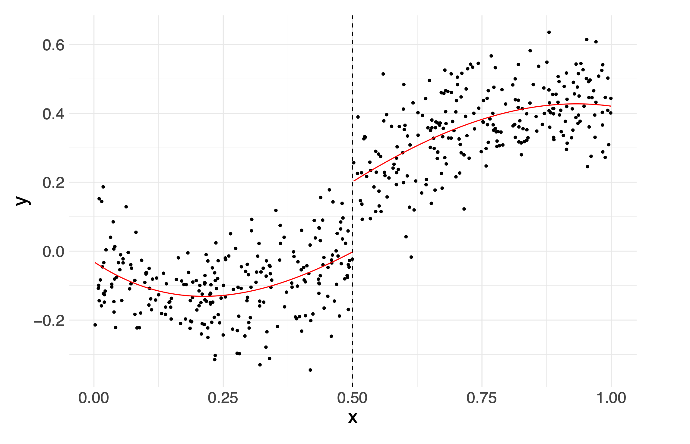

# Econometrics Review Slides 

I created these slides for API-202Z (Empirical Methods II) at Harvard Kennedy School.

They cover regression analysis, causal inference, and prediction with an emphasis on policy applications.

Thank you to Shiro Kuriwaki, Avery Schmidt, Teddy Svoronos, and all my students for their contributions

